# How to Setup a Raspberry PI With No Keyboard, No Mouse and No Ethernet Cable
## Intro
This tutorial explains how to setup a Raspberry PI using only command line (usually called “a headless setup”). The headless setup has the advantage that it can be done without needing a monitor and keyboard, as opposed to other types of setup. In a headless setup, the operating system (OS) is installed and configured entirely by command line.

The Raspberry PI runs under Linux, but comes out of the package without any operating system installed.  In this tutorial we show how to install Raspbian (a version of Debian Linux), which is the most common OS for the Raspberry Pi, and we will also show how to setup additional features.

Basically the steps required are as follows:

1. To install Raspbian (OS) we first need to download it to our computer to then transfer it to the Raspberry PI using the micro SD card.
2.	To transfer Raspbian from our computer to the Raspberry PI, we will use a micro SD car. The idea is to copy the OS from our computer to the SD card and from there to the Raspberry PI.
3.	After installing the OS in the Raspberry PI, we will update it and all the associated packages, plus any additional application we want.
4.	The last step will be to install the VCN application to manage the Raspberry PI remotely from our computer.

We explain how to achieve these steps in more detail below.

## Materials
*	A Raspberry Pi with WiFi on-board 
*	A micro SD card with SD adapter. We recommend at least 8GB of storage capacity.
*	A power supply for your Pi.
*	A computer connected to the same network you wish to connect your Pi to.
*	Download Raspbian from the RPi foundation. You can also download NoobS which is an Operating System installer / chooser.
*	PuTTY, a free SSH program. If you're on OSx or Linux, you can already SSH from your terminal.

## Burning the Operating System on the Mini SD Card
Unless you have bought a bundle with the OS already installed on your PI, you will need to install it. We recommend using Raspbian as the OS. For this, you will need to download Raspbian’s image to your computer and from there to the PI using the mini SD card. Note that the OS cannot be copied directly to the SD card, it needs to be burned into the SD card with a proper software.

Below we will provide the basic steps; additional information can be found on the link [2] under the “References” section below.

1.	The first step is to download Raspbian from the official site. This will usually be a zip file that then extracts to a file of type .img an image file.

Download “Raspbian Stretch with desktop and recommended software” from:
https://www.raspberrypi.org/downloads/

2.	We need to prepare the SD card to receive the OS image. For this, we will use a program called Etcher to format the SD card. Do not use Window’s formatting option.

Download Etcher from the link below. be sure to install the full version with Desktop, not the lite version.
 https://etcher.io/

3.	Before running the installer, eject any external storage devices such as USB flash drives and backup hard disks. This makes it easier to identify the SD card. Then insert the SD card reader into the slot on your computer or into the reader.

**Insert the card into the reader device** 

4.	To write the OS image to the SD card, run Etcher and select the Zip file with the OS image. Click on “Flash” and the image will be now on our SD card. On windows 10 various pop ups many emerge, just ignore them and wait until it will say Flash Complete.

Note that you don't need to extract the image or format the card prior to writing.

**Click the “Select Image” button and choose the .zip file with Rasbpian**

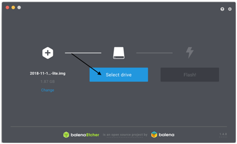

Click **Flash**

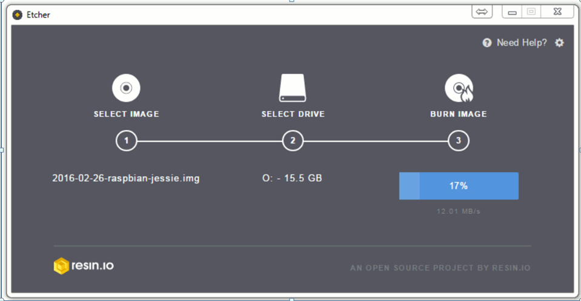

Etcher will take a few minutes to install Raspbian on your microSD card. When it's done (at least in Windows) you'll see a number of alerts prompting you to format the card. Close these dialog boxes or hit cancel on them (otherwise, you will format over the OS).

**Do not format the card again and ignore Window’s dialogue boxes.**

If you are not setting up a headless Raspberry Pi, you can just pop the card in, connect your Pi to a monitor, keyboard, power source and pointing device and boot it up.

If you have an Ethernet cable, you can plug your Raspberry Pi directly to a wired network and you should be able to access it by its name (raspberrypi or raspberrypi.local) without changing any other files.

## Allowing for Remote Connectivity (enabling SSH).
We now need to enable remote access to the PI. This will allow us to use PI’s commandprompt remotely from own computer. The Raspberry Pi will act as a remote device: you can connect to it using a client on another machine. You only have access to the command line, not the full desktop environment. For a full remote desktop, we will later install VNC.

Secure Shell (SSH) gives us a terminal into an operating system over a network and encrypts the traffic, giving us a level of security. For security reasons, SSH is no longer enabled by default. To enable it you need to place an empty filed named SSH (no extension) in the root of the boot disk.

The steps are as follows:

1.	After Etcher has finished flashing the drive, remove and reinsert the SD card so that your Windows or Mac PC can see the small FAT32 partition on the card (labeled "boot"). If you get a message telling you the card must be formatted, cancel it.
 
2.	Open the boot folder and create a new blank notepad file and save it in the boot drive as “ssh” without any extension in the end. Creating “ssh” file in the boot partition will enable ssh access as soon as the Pi boots. This will enable to configure our Raspberry Pi Zero Remotely. When we boot the Raspberry Pi, it looks for the SSH file and since we created it, the Raspberry Pi will enable the SSH and then deletes the file.

Do not eject the SD card yet as we need to configure the wifi connection.

## Configuring the Wifi (add network info)
In order to SSH into your Pi, you'll need to be connected to your local network. You can, of course, use Ethernet, but if you're using the Raspberry Pi 3, you've got WiFi built-in. So let's add our WiFi configuration to the Pi so it's available when we boot.

Next we will create a file that has the WIFI details. 

1.	 On the boot drive of the SD card, create another file called: “wpa_supplicant.conf” 

2.	Now we need to add our wifi details to the file. 
If using Windows you need to make sure the text file uses Linux/Unix style line breaks. I use Notepad++ (it’s free!) and this is easy to do using “Edit” > “EOL Conversion” > “UNIX/OSX Format”. “UNIX” is then shown in the status bar.

Edit the file like this:

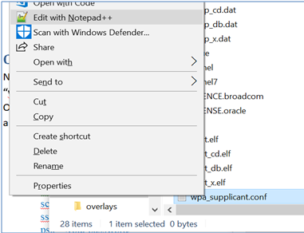

Copy the information on the Notepad++

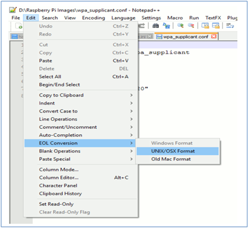

Open it and add the following details.  A list of configuration files for Raspbian Jesse, Raspbian Stretch and networks without passwords can be found in [4] on the “References” section below.

**For Raspbian Stretch:**

<pre><code>
country = your country id (in caps)
update_config=1
ctrl_interface=/var/run/wpa_supplicant
network={
scan_ssid=1
ssid= “your network name”
psk=”your password”
}
</code></pre>

**For Raspbian Jessie:**

<pre><code>
network={
ssid="YOUR_NETWORK_NAME"
psk="YOUR_PASSWORD"
key_mgmt=WPA-PSK
}
</code></pre>

Caution notes:
* Double check the SSID and password. 
*	Both the SSID and password should be surrounded by quotes. 
*	Don't put any spaces around the = in this file. 
*	Use the 2 letter country abbreviation in CAPS (without this you will have no WiFi).
*	Use a pure text editor, not a word processor, to edit the wpa_supplicant.conf file.
*	Make sure that both files are in the main directory of the small FAT32 partition, not in any folder. 

The Country Code should be set the ISO/IEC alpha2 code for the country in which you are using your Pi. 

Common codes include :
* GB (United Kingdom)
*	FR (France)
*	DE (Germany)
*	US (United States)
*	SE (Sweden)

The rest of the country codes can be found here:

https://en.wikipedia.org/wiki/ISO_3166-1_alpha-2#Officially_assigned_code_elements

## Booting the Raspberry PI

Lastly, safely eject the micro SD card from your PC and insert into the Pi. 

Power up the Pi and once it has booted you should be connected to your WiFi network. If Raspbian finds an ssh file it will enable SSH and delete the file. If it finds a wpa_supplicant.conf file, it will move it to its correct location and connect to your wireless network.

For the Raspberry Pi 3, you will need to flip it to see the card slot, as in the picture below.

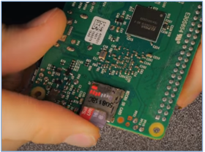

## Connect to Wifi. 
Since we don’t have access to the command prompt of the Raspberry Pi yet, we need a tool called PuTTY, which acts as a remote SSH Server (i.e. it’s an SSH client) so that we can access the Raspberry Pi’s command prompt from a remote computer. PuTTY establishes an SSH connection between the Raspberry Pi and another computer. It opens up a window that gives you access to the Raspberry Pi’s command prompt. 

**Mac**

If you’re using a Mac, you can SSH into the Pi with Terminal. A good tutorial on SSHing via Terminal can be found on [3] under the “References” section below.

**Windows**

Download and install PuTTY to your PC from here: https://www.putty.org

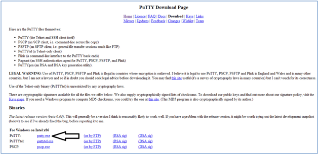

Plug the power cable the Pi. A red and a green light will show, let it boot for about a minute.

Or in Pi Zero:

## Login over Wifi (no Ethernet cable)

We know that the default hostname (the name of the machine) for a fresh Raspbian install is **raspberrypi**, so in the Host Name (or IP address) field enter **raspberrypi** (or raspberry.local). You usually need to add the .local if the Pi is directly connected to your PC via USB or Ethernet cable.

This searches for machines on that name on the local network. Once a connection is established, you'll be prompted by PuTTY to accept the connection to the new machine. You should see a black terminal prompting for a login. 

Enter the default **username: pi** and the default **password: raspberry**

Click **Ok** if you get a security warning alert. It's not a problem.
Enter **pi** as your username and **raspberry** as your password. You may want to change these later.

## Enabling Remote Login and Connecting Over VNC
Enter **sudo raspi-config** at the command prompt. 

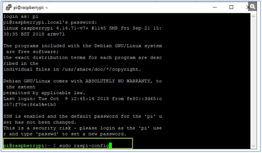

A configuration app opens.
Select **Interfacing Options** (number 5 on the list)

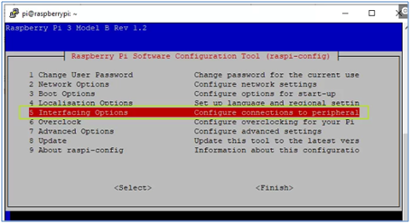

Select **VNC** (number 3 on the menu) 

Select **Yes**

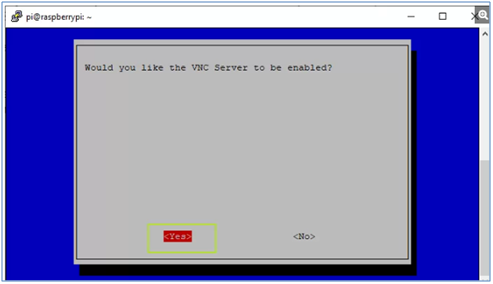

Hit **Enter** to acknowledge the VNC server is enabled.

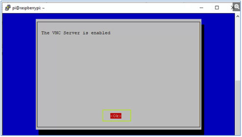

Select **Finish**

On your PC:

1. Download, install and launch VNC Viewer from here: https://www.realvnc.com/en/connect/download/viewer/

2. Select **New connection** from the File menu.

3. Enter **raspberry.local** in the "VNC Server" field. If this does not work, try again with the name **raspberrypi** without .local.

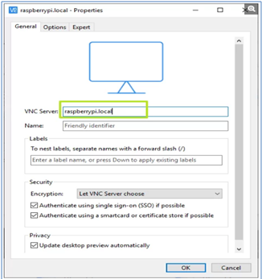

4. Click **Ok**.

5. Double-click on the connection icon to connect.

6. Click Ok if you are shown a security warning.

7. Enter the Pi's username and password when prompted. 
The defaults are: 

> username: pi 
> password: raspberry. 

Click **Ok**

Your Raspberry Pi desktop will then appear in a window on your main computer's desktop. 

You'll be able to control everything from there.

## Changing the Username and Password
On the command line, execute following command to start the configuration tool:

> sudo raspi –config

It is highly recommended to change the default password to something different. This can be done using the “Change User Password” menu option.

## Updating Raspbian
To update Raspbian, you need to open the Terminal. Do this via the desktop menu, or by pressing **Ctrl + Alt + T**

Updating your Raspbian installation is a two-step process:

> sudo apt-get update
> sudo apt-get upgrade

The first of these commands (**sudo apt-get update**) makes a call to the **Advanced Packaging Tool (apt)** to update the package list, this is highly important as the install and upgrade commands only search the pre-grabbed package list and don’t make any attempts to update it themselves.

The **update** command works this by searching the **/etc/apt/sources.list** file, and then polling all the websites in the list for all available packages creating a list of their download location and their current version. It utilizes the Advanced Packaging Tool(apt), but this time it uses it to check all currently installed packages against the package list, if there is a version miss-match for any it will attempt to update it by downloading the new version from the link in the list. The upgrade tool will never remove a package

> sshpi@<new_hostname>.local

Perform a final reboot, and you’re done

> sudo reboot

## References and Additional Resources.

1.	How to setup the PI with keyboard and monitor:

https://www.imore.com/how-get-started-using-raspberry-pi

https://lifehacker.com/the-always-up-to-date-guide-to-setting-up-your-raspberr-1781419054

2.	How to use Etcher:

Windows:

https://learn.adafruit.com/adafruit-raspberry-pi-lesson-1-preparing-and-sd-card-for-your-raspberry-pi/making-an-sd-card-using-a-windows-vista-slash-7

Mac:

https://learn.adafruit.com/adafruit-raspberry-pi-lesson-1-preparing-and-sd-card-for-your-raspberry-pi/making-an-sd-card-using-a-mac

3.	Tutorial on SSHing via Mac Terminal:

https://learn.adafruit.com/adafruits-raspberry-pi-lesson-6-using-ssh/using-ssh-on-a-mac-or-linux#

4.	List of WIFI configuration files for different Raspbian versions:

https://howchoo.com/g/ndy1zte2yjn/how-to-set-up-wifi-on-your-raspberry-pi-without-ethernet

https://www.raspberrypi.org/documentation/configuration/wireless/wireless-cli.md

