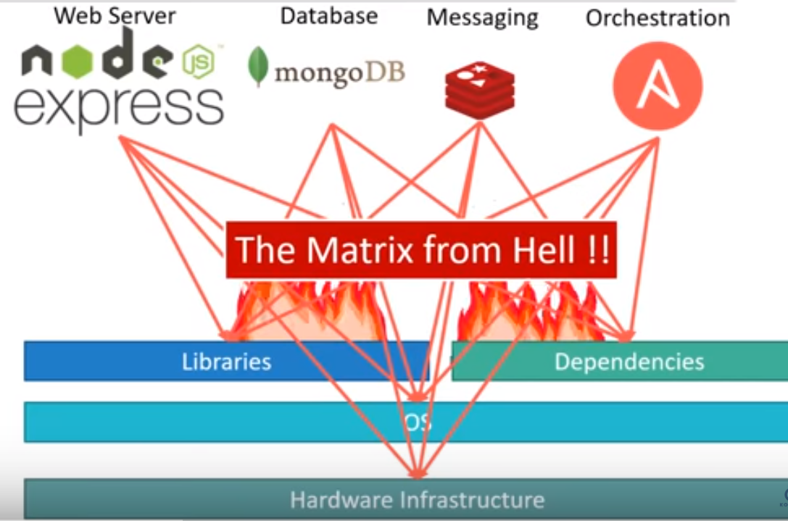
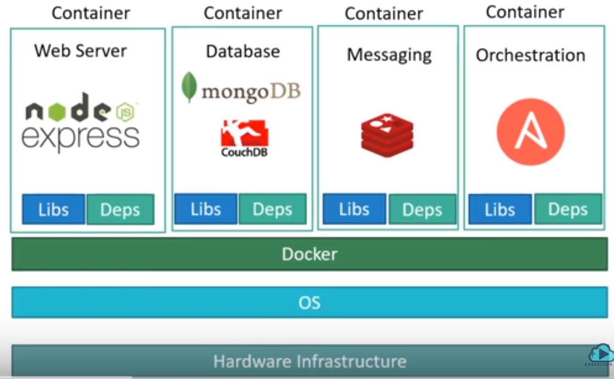

# Docker Tutorial

## Table of Contents
1. [What Problem Docker Solves?](#intro)

2. [Related Concepts](#concepts)
   1. [Containers](#containers)
   2. [Images](#images)
   3. [Dockerfiles](#dockerfiles)

3. [Differences between Docker and Virtual Machines](#VMvsDocker)

4. [Docker Architecture](#docker)
   1. [Definitions](#definitions)
   2. [Docker Components](#components)

5. [How do I orchestrate containers?](#orchestration) 

6. [Installing and Working With Docker](#working)
   1. [Installing Docker](#installing)
   2. [Working with the Docker toolbox](#toolbox)
   3. [Creating Images](#creatingImages)
   4. [Managing Containers](#managingContainers)
   5. [Configuring Docker](#configuringDocker)
 
7. [Where Can I Learn More?](#learnMore)

## What Problem Docker Solves? 

Docker is a container management service. The keywords of Docker are develop, ship and run anywhere. The whole idea of Docker is for developers to easily develop applications, ship them into containers which can then be deployed anywhere.

Docker’s main purpose is to give us run-time environments that we can re-create/reproduce on any machine (that runs Docker). 

The main advantage is to avoid the situations when we say “it worked on my machine”, because Docker containers will give us the same environment on all machines.

The official site for Docker is https://www.docker.com/ The site has all information and documentation about the Docker software. It also has the download links for various operating systems.

### Motivational example 

*The matrix from hell*

 The Matrix From Hell problem is the challenge of packaging any application, regardless of language/frameworks/dependencies, so that it can run on any cloud, regardless of operating systems/hardware/infrastructure.

 Docker solved for the matrix from hell by decoupling the application from the underlying operating system and hardware. It did this by packaging all dependencies inside Docker containers, including the OS. This makes Docker containers “portable,” i.e. they can run on any cloud or machine without the dreaded “it works on this machine” problems. 
 
 Depiction of the problem:

Depiction of the solution:

*Example*

A company needs to develop a Java Application. In order to do so the developer will setup an environment with tomcat server installed in it. Once the application is developed, it needs to be tested by the tester. Now the tester will again set up tomcat environment from the scratch to test the application. Once the application testing is done, it will be deployed on the production server. Again the production needs an environment with tomcat installed on it, so that it can host the Java application. 

If you see the same tomcat environment setup is done thrice. There are some issues that I have listed below with this approach:

1) There is a loss of time and effort.

2) There could be a version mismatch in different setups i.e. the developer & tester may have installed tomcat 7, however the system admin installed tomcat 9 on the production server. 

Now, Docker container can be used to prevent this loss. 

In this case, the developer will create a tomcat docker image ( A Docker Image is nothing but a blueprint to deploy multiple containers of the same configurations ) using a base image like Ubuntu, which is already existing in Docker Hub (Docker Hub has some base docker images available for free) . Now this image can be used by the developer, the tester and the system admin to deploy the tomcat environment. This is how docker container solves the problem.

## Related Concepts 

### Containers 

Containers allow a developer to package up an application with all of the parts it needs, such as libraries and other dependencies, and ship it all out as one package. By doing so, thanks to the container, the developer can rest assured that the application will run on any other Linux machine regardless of any customized settings that machine might have that could differ from the machine used for writing and testing the code.

### Images 

Images are the immutable master template that is used to pump out containers that are all exactly alike.

An image contains the Dockerfile, libraries, and code your application needs to run, all bundled together.

### Dockerfiles 
A Dockerfile is a script with commands (instructions) for how Docker should build your image.

The Dockerfile refers to a base image that is used to build the initial image layer. Popular official base images include python, ubuntu, and alpine.

Additional layers can then be stacked on top of the base image layers, according to the instructions in the Dockerfile. For example, a Dockerfile for a machine learning application could tell Docker to add NumPy, Pandas, and Scikit-learn in an intermediate layer.

## Differences between Docker and Virtual Machines 
In a way, Docker is a bit like a virtual machine. But unlike a virtual machine, rather than creating a whole virtual operating system, Docker allows applications to use the same Linux kernel as the system that they're running on and only requires applications be shipped with things not already running on the host computer. This gives a significant performance boost and reduces the size of the application.

* Virtualization lets your operating systems (Windows or Linux) run simultaneously on a single hardware system. 
  
* Virtualization uses a hypervisor to emulate hardware which allows multiple operating systems to run side by side. This isn’t as lightweight as using containers. 

* A hypervisor is a piece of software, firmware, or hardware that VMs run on top of. The hypervisors themselves run on physical computers, referred to as the “host machine”. The host machine provides the VMs with resources, including RAM and CPU. These resources are divided between VMs and can be distributed as you see fit. So if one VM is running a more resource heavy application, you might allocate more resources to that one than the other VMs running on the same host machine.
  
* Unlike a VM which provides hardware virtualization, a container provides operating-system-level virtualization by abstracting the “user space”. Containers share the same operating system kernel and isolate the application processes from the rest of the system. Linux containers are extremely portable, but they must be compatible with the underlying system.

* Container images provide portability and version control, helping ensure that what works on a developer’s laptop also works in production.

### Resources administration
The following image explains how Virtual Machine and Docker Container utilizes the resources allocated to them.

Consider a situation depicted in the above image.  I have a host system with 16 Gigabytes of RAM and I have to run 3 Virtual Machines on it. To run the Virtual Machines in parallel, I need to divide my RAM among the Virtual Machines. Suppose I allocate it in the following way:

* **6 GB** of RAM to my first VM,
* **4 GB** of RAM to my second VM, and
* **6 GB** to my third VM.

In this case, I will not be left with anymore RAM even though the usage is:

* My first VM uses only **4 GB** of RAM – Allotted 6 GB – 2 GB Unused & Blocked

* My second VM uses only **3 GB** of RAM – Allotted 4 GB – 1 GB Unused & Blocked
  
* My third VM uses only **2 GB** of RAM – Allotted 6 GB – 4 GB Unused & Blocked
  
This is because once a chunk of memory is allocated to a Virtual Machine, then that memory is blocked and cannot be re-allocated. I will be wasting **7 GB (2 GB + 1 GB + 4 GB)** of RAM in total and thus cannot setup a new Virtual Machine. This is a major issue because RAM is a costly hardware.

*Docker does better resource management*

If I use Docker, my CPU will allocates exactly the amount of memory that is required by the Docker Container.

* My first container will use only **4 GB** of RAM – Allotted 4 GB – 0 GB Unused & Blocked

* My second container will use only **3 GB** of of RAM – Allotted 3 GB – 0 GB Unused & Blocked

* My third container will use only **2 GB** of RAM – Allotted 2 GB – 0 GB Unused & Blocked

Since there is no allocated memory (RAM) which is unused, I save **7 GB (16 – 4 – 3 – 2)** of RAM by using Docker Container. I can even create additional containers from the leftover RAM and increase my productivity.

So here Docker Container clearly wins over Virtual machine as I can efficiently use my resources as per my need.

### Booting time

When it comes to start-up, Virtual Machine takes a lot of time to boot up because the guest operating system needs to start from scratch, which will then load all the binaries and libraries. This is time consuming and will prove very costly at times when quick startup of applications is needed. 

In case of Docker Container, since the container runs on your host OS, you can save precious boot-up time. 

Consider a situation where I want to install two different versions of Ruby on my system. If I use Virtual Machine, I will need to set up 2 different Virtual Machines to run the different versions. Each of these will have its own set of binaries and libraries while running on different guest operating systems. Whereas if I use Docker Container, even though I will be creating 2 different containers where each container will have its own set of binaries and libraries, I will be running them on my host operating system. Running them straight on my Host operating system makes my Docker Containers lightweight and faster.

## Docker Architecture and Definitions 

### Definitions 
The word "DOCKER" refers to several things. This includes an open source community project; tools from the open source project; Docker Inc., the company that is the primary supporter of that project; and the tools that the company formally supports. The fact that the technologies and the company share the same name can be confusing.

Here's a quick explanation:

* The IT software "Docker” is containerization technology that enables the creation and use of Linux® containers.

* The open source Docker community works to improve these technologies to benefit all users—freely.

* The company, Docker Inc., builds on the work of the Docker community, makes it more secure, and shares those advancements back to the greater community. It then supports the improved and hardened technologies for enterprise customers.

### Docker Components 
Docker has the following components:

* **Docker for Mac** − It allows one to run Docker containers on the Mac OS.

* **Docker for Linux**  − It allows one to run Docker containers on the Linux OS.

* **Docker for Windows**  − It allows one to run Docker containers on the Windows OS.

#### Docker Architecture
Docker Architecture includes:

* **Docker Engine**  − Docker engine is the layer on which Docker runs. It is the underlying client-server technology that creates and runs the containers, manages images, builds, and more. It runs natively on Linux systems and is made up of:

  1. A Docker Daemon that runs in the host computer.
  2. A Docker Client that then communicates with the Docker Daemon to execute commands.
  3. A REST API for interacting with the Docker Daemon remotely.

* **Docker Client** – It is used to trigger Docker commands.The Docker Client is what you, as the end-user of Docker, communicate with. Think of it as the UI for Docker. 

* **Docker Host** – Runs the Docker Daemon 
  
* **Docker Daemon** − The Docker daemon is what actually executes commands sent to the Docker Client — like building, running, and distributing your containers. The Docker Daemon running within Docker Host is responsible for the images and containers. 

* **Docker Image** − Images are read-only templates that you build from a set of instructions written in your Dockerfile. Images define both what you want your packaged application and its dependencies to look like *and* what processes to run when it’s launched. These Read only templates are used for creating containers by using the run command. 

* **Docker Registry** –  Docker Registry is where the Docker Images are stored. The Registry can be either a user’s local repository or a public repository like a Docker Hub allowing multiple users to collaborate in building an application. Even with multiple teams within the same organization can exchange or share containers by uploading them to the Docker Hub. Docker Hub is Docker’s very own cloud repository similar to GitHub.
 
* **Docker Hub**  − While building containers is easy, don’t get the idea that you’ll need to build each and every one of your images from scratch. Docker Hub is a SaaS repository for sharing and managing containers, where you will find official Docker images from open-source projects and software vendors and unofficial images from the general public. You can also create a local Docker registry if you prefer.

    This link contains additional information together with a step-by-step tutorial:

    https://www.tutorialspoint.com/docker/docker_hub.htm

* **Docker Compose** − This is used to define applications using multiple Docker containers.

* **Docker Containers** − A Docker container, as discussed above, wraps an application’s software into an invisible box with everything the application needs to run. That includes the operating system, application code, runtime, system tools, system libraries, and etc. Docker containers are built off Docker images. Since images are read-only, Docker adds a read-write file system over the read-only file system of the image to create a container.

* **Docker run** - Docker’s run utility is the command that actually launches a container. Each container is an instance of an image.

## How do I orchestrate containers? 
Simply putting your applications into containers probably won't create a phenomenal shift in the way your organization operates unless you also change how you deploy and manage those containers. One popular system for managing and organizing Linux containers is Kubernetes. 

Kubernetes is an open source system for managing clusters of containers. To do this, it provides tools for deploying applications, scaling those application as needed, managing changes to existing containerized applications, and helps you optimize the use of the underlying hardware beneath your containers. It is designed to be extensible, as well as fault-tolerant by allowing application components to restart and move across systems as needed.

## Installing and Working With Docker 

### Installing Docker 

* To install Docker on Linukx follow this tutorial:
  
  https://www.tutorialspoint.com/docker/installing_docker_on_linux.htm

* To install Docker on Windows follow this tutorial:

https://www.tutorialspoint.com/docker/docker_installation.htm

### Working with the Docker Toolbox 
The first step is to launch the Docker Toolbox application from the shortcut created on the desktop at installation. 

Next, you will see the configuration being carried out when Docker toolbox is launched.

Once done, you will see Docker configured and launched. You will get an interactive shell for Docker.

### Creating Images 
The below link provides a tutorial on creating Docker images:

https://www.tutorialspoint.com/docker/docker_images.htm

Creating your own images on Docker files

https://www.tutorialspoint.com/docker/docker_file.htm

https://www.tutorialspoint.com/docker/building_docker_files.htm

https://www.tutorialspoint.com/docker/docker_instruction_commands.htm

### Managing Containers 
The below links provide a tutorial on managing containers:

Managing containers:

https://www.tutorialspoint.com/docker/docker_containers.htm

Working with containers:

https://www.tutorialspoint.com/docker/docker_working_with_containers.htm

Containers and hosts:

https://www.tutorialspoint.com/docker/docker_container_and_hosts.htm

Containers and shells:

https://www.tutorialspoint.com/docker/docker_containers_and_shells.htm

Container linking:

https://www.tutorialspoint.com/docker/docker_container_linking.htm

### Configuring Docker 
The below link provides a tutorial on configuring Docker:

https://www.tutorialspoint.com/docker/configuring_docker.htm

## Where Can I Learn More? 

1. Docker web-based tutorial
   
   https://docs.docker.com/engine/docker-overview/

2. Online tutorials:
   Basic:
   
    https://www.edureka.co/blog/what-is-docker-container

    https://www.youtube.com/watch?v=rmf04ylI2K0

    Advanced:

    https://www.tutorialspoint.com/docker

3. Docker cheatsheet
   
   https://kapeli.com/cheat_sheets/Dockerfile.docset/Contents/Resources/Documents/index
