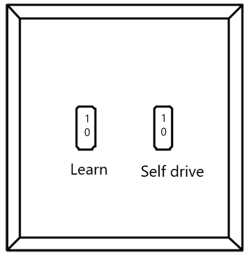
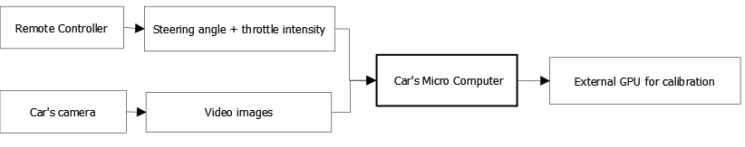
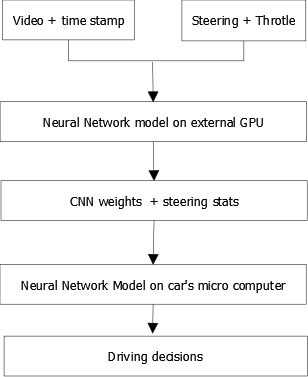
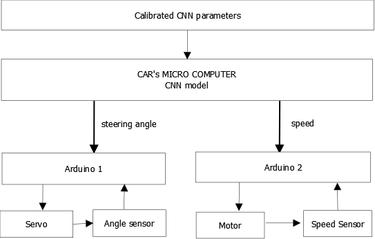
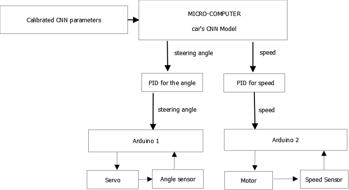

# FOOCAR SCHEMA

## Table of Contents
1. [Car Modes](#modes)

2. [Car Architecture](#architecture)

3. [Where Can I Learn More?](#biblio)

## Car Modes 
The car can be setup to perform three different tasks. The type of task to be performed is controlled by onboard switches, as described in the image below.

The settings work as follows:

| Switch 1    | Switch 2    | Car setting       | 
| ----------- | ----------- | ------------------|
| 0           | 0           |off                |
| 0           | 1           |self drive         |
| 1           | 0           |learn (record)     |
| 1           | 1           |learn + self drive |

Below we explain each task in detail.

**1. Data Collection Mode**
In this mode, the car acts as a recording device. The recorded variables are:

* video images
* steering angle 
* throttle intensity 
* time tracking 

To record the variables of interest, the car is run several times on the racing circuit using a remote controller.

As shown in the schema below, the video images are recorded using the car's PI embedded camera and stored on a mini computer attached to the car. The mini computer is usually a Raspberry PI or an NVIDIA board. The steering angle and speed are read directly from the signal sent by the remote controller.

**CNN Training**
The environment data gathered under the "Data Collection Mode" is passed to an external GPU to calibrate the car's motion planning model. The autonomous driving model is based on a Machine Learning model called Convolutional Neuronal Network (CNN). The paper [1] referenced in the Bibliography section explains the model in detail. 

After the CNN parameters are calibrated, they are uploaded to the car's own CNN model, which is stored on its mini computer. The car will call this model to take driving decisions while driving on autonomous mode. 

 
  
**2. Autonomous Driving Mode**
While running in autonomous mode, the car makes driving desitions based on the information it collects from its camera and other sensors. The live information collected are the video images plus the steering angle and speed collected from different sensors. This information is passed as inputs to the car's CNN model stored on its micro-computer. The model will output the car's motion planning decisions on real time. 

As shown below, There are two sensors, one collects information from the Servo motor and passes the steering angle as an input to the CNN model. The other sensor collects the speed information from the throttle motor. All the information is processed by the mocr-computer on live mode.
 

**3. Data Collection in Autonomous Mode**
This mode is a combination of the two above. The car is able to record the steering angles and camera images while driving in autonomous mode. 

## Car Architecture 
Below we show a diagram of Fuvette's architecture. This car works as explained above but in addition, it includes PID controllers for lateral motion planning.

## Bibliography 
1. *End to End Learning for Self Driving Cars*
   
        https://arxiv.org/abs/1604.07316

2.FUBAR Lab's Github page:

     https://github.com/fubarlabs/foocars
