# How To Use Github To Collaborate With Others

## Table of Contents
1. [Introduction](#intro)
2. [Git vs. GitHub](#GitvsGitHub)
3. [Setup Git](#setup)
4. [Fork a repo ](#fork)
5. [Clone](#clone)
6. [Push](#push)
7. [Sync](#sync)
8. [Pull](#pull)
9. [Branches](#branches)
10. [References](#references)


##Introduction <a name="intro"></a>

This guide explains how to contribute to a GIT project. The reader can find more information in the links [1] and [2] on the "References" section at the bottom of the tutorial.

A good book on GIT can be found for free here:
https://git-scm.com/book/en/v2

**The basic steps for contributing to a project are:**
•  [Fork the repository](https://guides.github.com/activities/forking/#fork). – This will create a personal copy of the project on Github.

•  [Clone your fork](https://guides.github.com/activities/forking/#clone) – This will create a copy of the forked project on your computer, to work on it.
•	[Making and pushing changes](https://guides.github.com/activities/forking/#making-changes) - Stage and commit
•  [Making a Pull Request](https://guides.github.com/activities/forking/#making-a-pull-request) - propose changes into the main project
•	Sync your project with the main repository


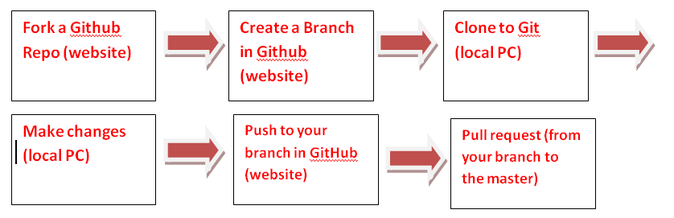

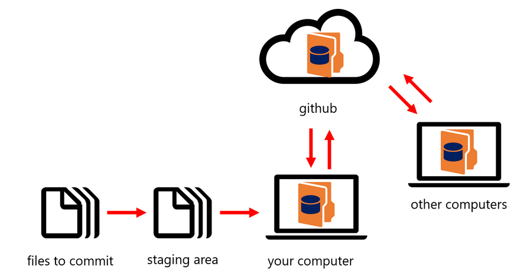

In summary, to contribute to other people’s projects, they must be uploaded to GITHUB, from there, you will make a copy in Github (“fork”) , download this copy to your local computer (“clone”) , make the changes and submit the changes for approval (“pull request”).


## Git vs. GitHub  <a name="GitvsGitHub"></a> 
First note the difference between GIT and GITHUB. 

**GIT** is an application that allows you to do version control on your own computer. It helps you keep track of the changes you’ve made to your files. It’s a more precise version of CTRL-Z in that you can save a whole bunch of files with one command, and if you screw up you can revert back to the previous version easily.

 **GitHub** is an online service that allows you to host your Git repositories online and collaborate with others on them. You can use GitHub through their web portal as well as the GitHub desktop GUI and the Git Shell. An alternative to GitHub is GitLab.

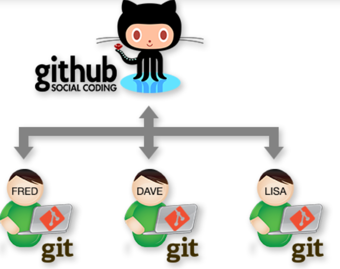
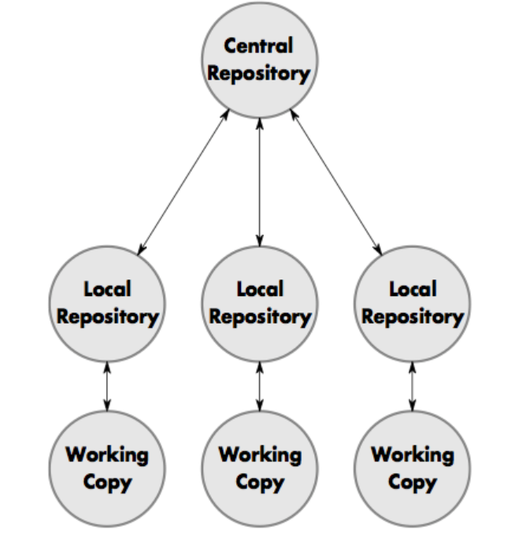
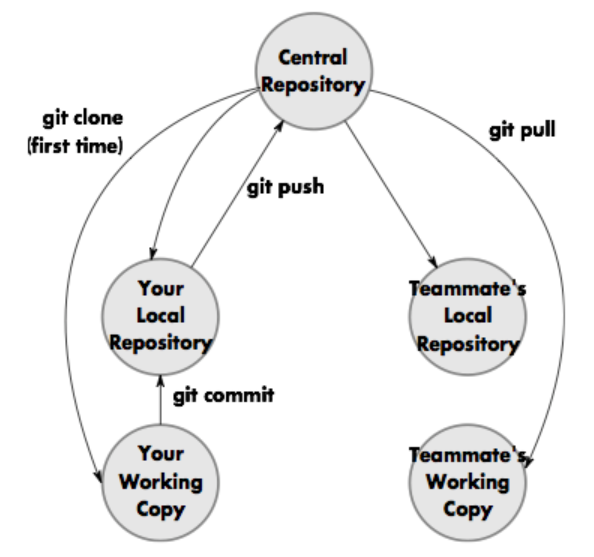

Some Terminology:
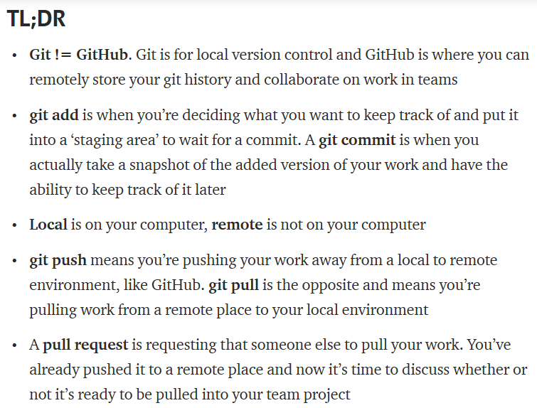

---
The ***repo[sitory]*** corresponds to the collaborated work of the team across one or many branches. All contributors have their own copy of it.

Each ***fork*** of the main repo corresponds to a contributor's work. A fork is really a Github (not Git) construct to store a clone of the repo in your user account. As a clone, it will contain all the branches in the main repo at the time you made the fork.

***Fork*** is another way of saying clone or copy. So, unlike a branch, a fork is independent from the original repository. If the original repository is deleted, the fork remains. If you fork a repository, you get that repository and all of its branches.

Each ***branch*** within the fork and/or in the main repo can correspond to several kinds of things, depending on how you want to work. Each branch could refer to a version of the project but can also correspond to different channels of development, like hotfixes or experimental work.

The ***pull request*** (in the GitHub ecosystem) corresponds to the task. Every time I want to contribute an isolated finished task to the main repo, I create a pull request corresponding to the commits made in that task. These commits are pulled from either my fork or my branch to the main repo.

A ***commit*** is a set of changes to the code. This is one of the most interesting things about Git. You don't transfer files, you transfer logs of changes.

---

##Setup Git <a name="setup"></a> 
Steps:
1.	Setup Git:
https://help.github.com/en/articles/set-up-git

2.	Set up authentication to GitHub from Git:
https://help.github.com/en/articles/set-up-git#next-steps-authenticating-with-github-from-git

3.	Fork the project and create a branch in Guthub

4.	Create a local clone of your project in Git

## Fork a repo  <a name="fork"></a> 
These steps are to work on projects that are hosted on GitHub and have already been initialized. 

The first step is to copy the repository into a fork in GitHub's website, which is a personal copy of someone else’s repository. Forking a repository allows you to freely experiment with changes without affecting the original project.  

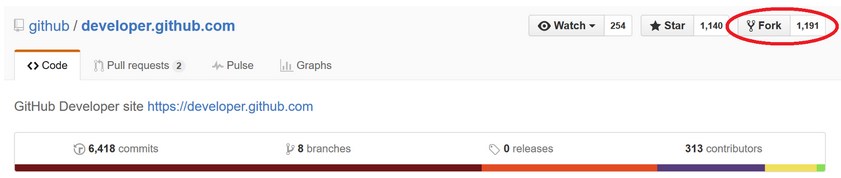
 
Forking a repository essentially copies that project to your online GitHub account. However, to work on that project on your local computer, you must clone the project.

##Clone your fork in your local computer  <a name="clone"></a> 
Forking a repo only copies it on your online GitHub account. To be able to work on the project, you will need to clone it to your local computer. 

Cloning a project copies a Git repository with its version history, by its URL, to your local computer from GitHub. From there, you can make and commit changes of your own to that repository. Any changes you commit and then push to GitHub (see below) are saved for your copy of that project.

On GitHub, you can do this by navigating to the main page of the repository.

Note: If the repository is empty, you can manually copy the repository page's URL from your browser.

Otherwise:  In the Clone with HTTPs section, click to copy the clone URL for the repository.

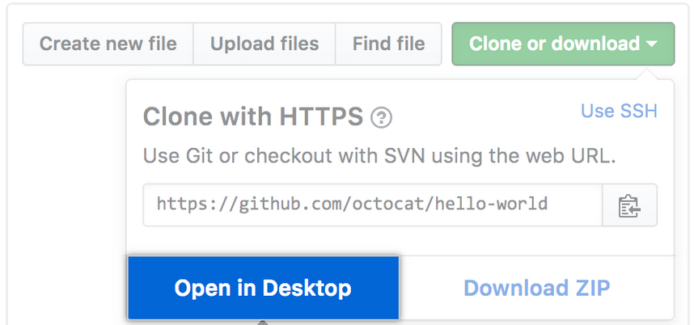

Click **“Choose”**  and, using Windows Explorer, navigate to a local path where you want to clone the repository and click on **“Clone”**.

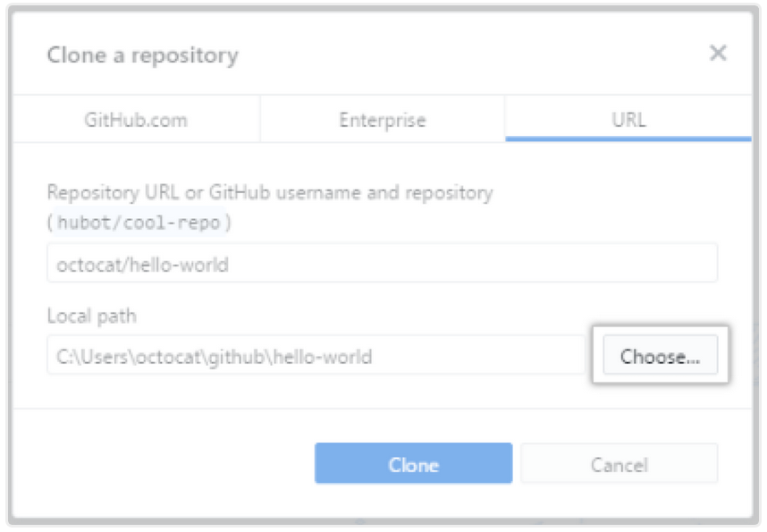

#### Clone using command line:
•  Open Git Bash.

•  Change the current working directory to the location where you want the cloned directory to be made.

•  Type git clone, and then paste the URL of your GitHub repo.

```$ git clone https://github.com/YOUR-USERNAME/YOUR-REPOSITORY```

•  Press Enter. Your local clone will be created.


    > Cloning into `Spoon-Knife`...
    > remote: Counting objects: 10, done.
    > remote: Compressing objects: 100% (8/8), done.
    > remove: Total 10 (delta 1), reused 10 (delta 1)
    > Unpacking objects: 100% (10/10), done.

## Making and pushing changes <a name="push"></a> 

Right now, you’ve essentially told Git, “Okay, I’ve taken a snapshot of my changes!” You can continue to make more changes, and take more commit snapshots. When you’re ready to push your changes up to GitHub.com, push your changes to the remote.

When you have completed a coding milestone, or want to snapshot certain changes, you add the files you changed to a staging area and then commit them to the version history of your project (repository) using Git.

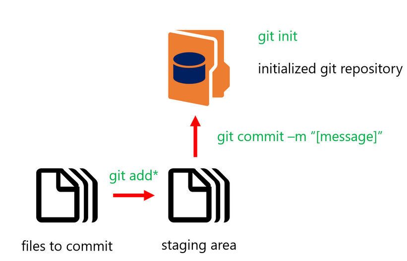 

## Sync your project with the main repository <a name="sync"></a> 

It is important to be in sync with the main repo before making a pull request. 

Tip: Syncing your fork only updates your local copy of the repository. To update your fork on GitHub (the website), you must push your changes (see below “Making a Pull Request”)

 When you fork a project in order to propose changes to the original repository, you can configure Git to pull changes from the original, or upstream, repository into the local clone of your fork. This will update your local repo with the latest changes in GitHub.

#### Syncing your fork to the original repository via the browser
Reference:
https://stackoverflow.com/questions/20984802/how-can-i-keep-my-fork-in-sync-without-adding-a-separate-remote/21131381#21131381
https://github.com/KirstieJane/STEMMRoleModels/wiki/Syncing-your-fork-to-the-original-repository-via-the-browser

When you create a fork of a repository you only have the versions of the files that are in the repository at that time. So if there are any changes in the original repository you may find that your version (your fork) is out of sync. 
This can lead to problems when you try to create a pull request.

While GitHub has instructions for merging an upstream repository into your fork they require you to have git installed on your local machine.

You can update your fork in the browser by following the easy steps laid out in this Stack Overflow answer.

The Stack Overflow link has pictures which are really helpful, but briefly, here's what you do:

1.Open your fork of the repository.

2.Click the compare button.

This will open a page titled Comparing Changes and if you look carefully you'll have jumped to the upstream version of the repository. If you were to do a regular pull request then this makes sense as you'd be bringing your changes into the upstream version. But in this case we want to flip the direction and pull changes from the original version to our fork.

3.Change the base fork to your repository

4.You're now back to your fork but you've also asked to compare two identical repositories so GitHub thinks you care about branches not forks. Click on compare across forks to get back your base fork option.

5.Change the head fork to the upstream (original) repository

Note at this point that if you were in control of everything at GitHub you would probably just have put a little button in between the base for and head fork that would have flipped them for you rather than doing all these clicks. You might even had added in a separate button to check for upstream changes! But they do know that this is a bit of a silly hack and they're working hard on a bunch of other cool stuff so we'll let them off this one.

6.You'll see one of two options:

•	"There isn’t anything to compare" This means you're up to date and you don't have to do anything. Phew.  
•	A list of commits. These are the changes that have happened in the repository since you forked your version. Go to step 7.

7.Create a pull request

Note that this pull request is to you! So you can confirm that it's ok and merge it when necessary. And if there are any merge conflicts then it's up to you to figure out what's gone wrong and sort them out.
And now you're ready to continue working on your fork    

#### Using command line
Reference:
https://help.github.com/en/articles/syncing-a-fork

Before you can sync your fork with an upstream repository, you must configure a remote that points to the upstream repository in Git.

1.Open Git Bash.

2.Change the current working directory to your local project.

3.Fetch the branches and their respective commits from the upstream repository. Commits to master will be stored in a local branch, upstream/master.

    >$ git fetch upstream
    > remote: Counting objects: 75, done.
    > remote: Compressing objects: 100% (53/53), done.
    > remote: Total 62 (delta 27), reused 44 (delta 9)
    > Unpacking objects: 100% (62/62), done.
    > From https://github.com/ORIGINAL_OWNER/ORIGINAL_REPOSITORY
    >  * [new branch]      master     -> upstream/master

4.Check out your fork's local master branch.

    $ git checkout master

    > Switched to branch 'master'

5.Merge the changes from upstream/master into your local master branch. This brings your fork's master branch into sync with the upstream repository, without losing your local changes.

    >	$ git merge upstream/master
    > Updating a422352..5fdff0f
    > Fast-forward
    >  README                    |    9 -------
    >  README.md                 |    7 ++++++
    >  2 files changed, 7 insertions(+), 9 deletions(-)
    >  delete mode 100644 README
    >  create mode 100644 README.md

If your local branch didn't have any unique commits, Git will instead perform a "fast-forward": 

    > $ git merge upstream/master
    > Updating 34e91da..16c56ad
    > Fast-forward
    >  README.md                 |    5 +++--
    >  1 file changed, 3 insertions(+), 2 deletions(-)


## Making a Pull Request <a name="pull"></a> 

At last, you’re ready to propose changes into the main project. 

When you open a pull request, you’re proposing your changes and requesting that someone review and pull in your contribution and merge them into their branch. Pull requests show diffs, or differences, of the content from both branches. The changes, additions, and subtractions are shown in green and red.

 

Head on over to the repository on GitHub.com where your project lives. For this example, it would be at:

``https://www.github.com/<your_username>/<your project>.`` 

You’ll see a banner indicating that you’ve recently pushed a new branch, and that you can submit this branch “upstream,” to the original repository:

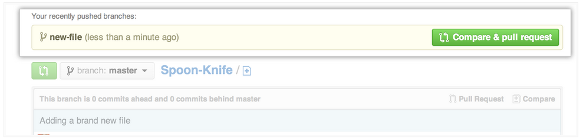 
 
Clicking on **Compare and Pull Request** sends you to a discussion page, where you can enter a title and optional description. It’s important to provide as much useful information and a rationale for why you’re making this Pull Request in the first place. The project owner needs to be able to determine whether your change is as useful to everyone as you think it is.

When you’re satisfied that these are the changes you want to submit, click the big green **Create Pull Request** button. 

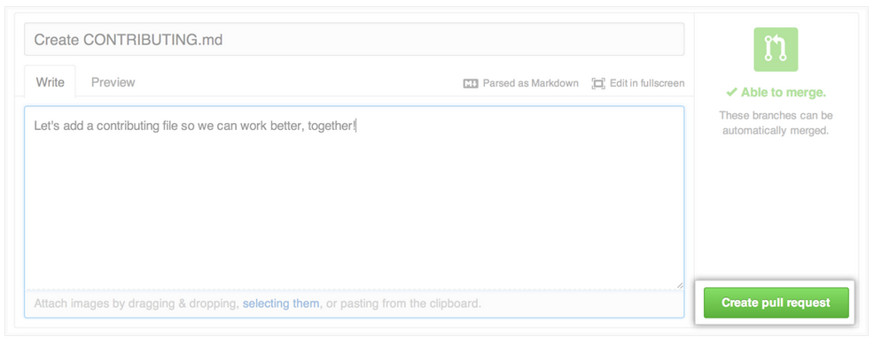 

A pull request is one of the most confusing GitHub terms. A pull request is not the same thing as 'git pull'. When you work alone, you don’t need to request anything from anyone. You just push everything into GitHub because you’re the only one reviewing your code and you just want to store it. Working in a team, you push your separate work into GitHub (in a branch), then open a pull request to open discussion about your work, then your team decides if they want to pull in the code and merge it to the master.

#### Using Command Line

```git push [repo] [branch]```

To publish a new initialized repository or any committed changes from your local repositories to GitHub, you use **git push** with the repository and branch of your code. The default syntax that you will generally use is:
 
``` git push origin master. ```
 
 This pushes your code to the master branch (see below) of your repository.

#### git pull
If any changes happen to a repository that you wish to pull from GitHub to your local computer, such as when collaborating on a project with others, you simply use

``` git pull.```

FYI
It is important to remember, that while you may have a repository hosted on GitHub, the version history of your local copy can be different than the version history of your repository online.

Thus, if you try to pull or push changes to files that have already been changed by someone else, and those changes are already on GitHub, you can run into a merge conflict. 

Essentially, a merge conflict is when the version history of the repository on your local computer is different from the repository’s version history on GitHub. You will need to eventually resolve the merge conflict manually to bring all of the repository’s changes together.

 
## Branches <a name="branches"></a> 
Reference:
https://help.github.com/en/articles/creating-and-deleting-branches-within-your-repository

Branching is the way to work on different versions of a repository at one time.

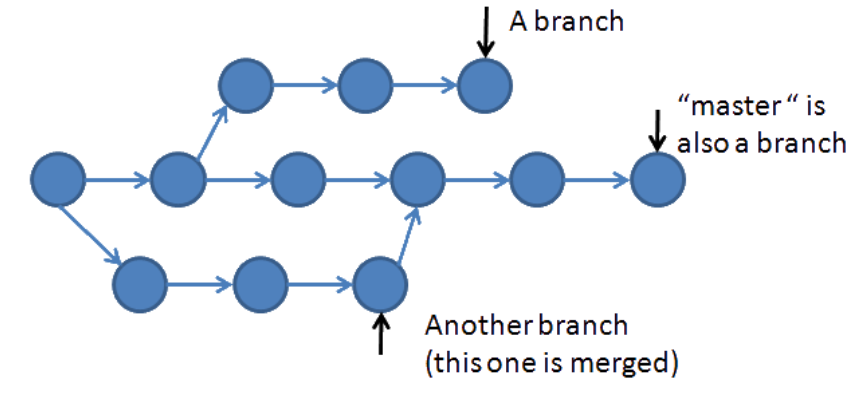 

By default your repository has one branch named master which is considered to be the definitive branch. We use branches to experiment and make edits before committing them to master.

When you create a branch off the master branch, you’re making a copy, or snapshot, of master as it was at that point in time. If someone else made changes to the master branch while you were working on your branch, you could pull in those updates.


#### Steps to create a branch:

•  On GitHub, navigate to the main page of the repository.

•  Click the branch selector menu. 

And directly type the new name of the branch. This will automatically create a new branch with that name. (see image below)

•  Press Enter

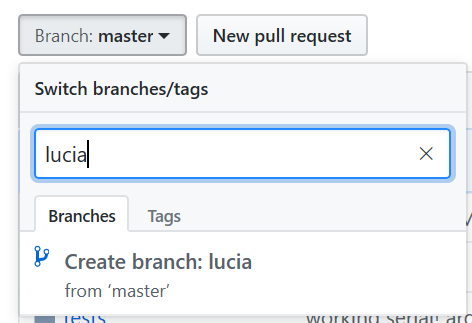 

## References <a name="references"></a> 
[1] https://guides.github.com/activities/forking/
[2] https://help.github.com/en/articles/fork-a-repo
To create a GIT repo from scratch:
https://medium.com/@abhishekj/an-intro-to-git-and-github-1a0e2c7e3a2f


