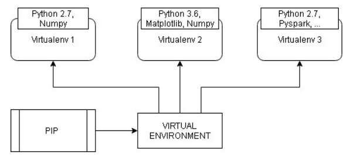

# Python Virtual Environments

## Table of Contents
1. [What is a Virtual Environment?](#intro)
2. [When Should I use a Virtual Environment?](#use)
3. [How do I create a Virtual Environment?](#create)
4. [How Do I Use the Virtual Environment?](#useVE)
   1. [Option 1: VirtualEnv](#VirtualEnv)
   2. [Option 2: virtualenvwrapper](#virtualenvwrapper)
   3. [Option 3: Pipenv](#pipenv)
5. [Where Can I Learn More?](#learnMore)


## What is a Virtual Environment? <a name="intro"></a>

A virtual environment is a tool that helps us to work in multiple python projects while keeping their packages and dependencies separate. Basically, it is a best practice tool that allows us to cut unwanted dependencies between projects by creating isolated python virtual environments for them. For example, by default, every project on your system will use these same directories to store and retrieve site packages. 

Say that we have two projects and they both rely on the same package, but with a different version. If we upgrade this package globally for all our projects, it can break some of them.

This is where virtual environments come into play. To solve this problem, we just need to create two separate virtual environments for both the projects.

In an isolated environment, each project has only the dependencies and the packages that they need, with the specic versions that they need.




## When should I use a Virtual Environment? <a name="use"></a>
Virtual Environment should be used whenever you work on any Python-based project. It is generally good to have one new virtual environment for every Python project you work on. So the dependencies of every project are isolated from the system and each other.

Each environment will be its own virtual space. All packages installed within that space would not interfere with packages outside the environment and will be contained only inside this space.

## How do I create a Virtual Environment? <a name="create"></a>
There are various Virtual Environment packages available. We will review the most popular below.

### Option 1: Using Virtual Env <a name="VirtualEnv"></a>

Reference:

https://www.geeksforgeeks.org/creating-python-virtual-environment-windows-linux/

To build the different environments, we will use a library called VirtualEnv. Install this package using the package installer called **Pip**, which enables 3rd party package installations.

Follow these simple steps:

#### Linux

1.To test that Pip is installed open a command prompt and try 

```$ pip help```

If pip is not in your system

```$ sudo apt-get install python-pip```

2.Use pip to install 'virtualenv' by typing:

```$ pip install virtualenv``` 

4.Test your installation:

```$ virtualenv --version ``` 

5.Create a virtual environment for a project:
```$ cd project folder ``` 
```$ virtualenv virtualenv_name ```  

Note that the command ```virtualenv virtualenv_name``` will create a folder in the current directory which will contain the Python executables, and a copy of the "pip" library. You can now use the “pip” manager to install necessary dependencies and packages inside this virtual environment and keep your packages from conflicting with other project dependencies.

The name of the virtual environment (in this case, it was ```virtualenv_name```) can be anything; omitting the name will place the files in the current directory instead.

If you want to create a virtualenv for specific python version, type

```$ virtualenv -p /usr/bin/python3 virtualenv_name```

or

```$ virtualenv -p /usr/bin/python2.7 virtualenv_name```

6.To begin using the virtual environment, it needs to be     activated. When the environment is set up, a file called activate is created inside the bin folder in the environment. We set this file as the source and we are now inside the environment.
   
```$ source virtualenv_name/bin/activate```

Remember to activate the relevant virtual environment every time you work on the project.

7.Once you are done with the work, you can deactivate the virtual environment by the following command:

```(virtualenv_name)$ deactivate```

#### Windows
Reference:

http://timmyreilly.azurewebsites.net/python-pip-virtualenv-installation-on-windows/


1.Download pip from here to a folder on your computer:

https://bootstrap.pypa.io/get-pip.

Follow the instructions here:

https://www.liquidweb.com/kb/install-pip-windows/

2. On Window's command prompt type:   
   ```python get-pip.py```

3. Install virtualenv using

 ```> pip install virtualenv``` 

4. Now in which ever directory you are, this line below will create a virtualenv there

 ```> virtualenv myenv```

And here also you can name it anything.

5. Now if you are same directory then type,

 ```> myenv\Scripts\activate```

You can explicitly specify your path too.

Similarly like Linux you can deactivate it like

```$ deactivate```

#### How do I use the Virtual Environment? <a name="useVE"></a>
Now we need to install all the required packages and dependencies to run a project.

##### Windows
For references on how to install and use virtual environments on Windows see here:

http://timmyreilly.azurewebsites.net/python-pip-virtualenv-installation-on-windows/


##### Linux

Reference:

https://realpython.com/python-virtual-environments-a-primer/

1.Start by making a new directory to work with:

```$ mkdir python-virtual-environments && cd python-virtual-environments```


2.Create a new virtual environment inside the directory:

Python 2:
```$ virtualenv env_name```

Python 3
```$ python3 -m venv env_name```

3.Now you can install dependencies related to the project in this virtual
environment. For example if you are using Django 1.9 for a project, you can install it like you install other packages.

```(env_name)$ pip install Django==1.9```

The Django 1.9 package will be placed in virtualenv name folder and will be isolated from the complete system.

### Option 2: virtualenvwrapper <a name="virtualenvwrapper"></a>

References:

http://www.futurile.net/2013/10/03/virtualenv-and-virtualenvwrapper-for-python-development/

https://realpython.com/python-virtual-environments-a-primer/


virtualenvwrapper provides a set of commands which makes working with virtual environments much more pleasant. It also places all your virtual environments in one place. It really helps when you have a lot of environments and have trouble remembering their names.

Further installation instructions and commands can be found here:

https://virtualenvwrapper.readthedocs.io/en/latest/install.html

* To install (make sure virtualenv is already installed):
    ```$ pip install virtualenvwrapper```

    or:

    ```sudo apt-get install virtualenvwrapper```

* The next step is to define where the source code of your projects is going to be

    ```$ export WORKON HOME=~/Envs```
    ```$ source /usr/local/bin/virtualenvwrapper.sh```

* In Windows: 
  ```pip install virtualenvwrapper-win``` (for Windows)
In Windows, the default path for WORKON HOME is 

    ```%USERPRO-FILE%Envs```

* Now, anytime you want to start a new project, you just have to do this:
```$ mkvirtualenv my-new-project```

* To work on a project you use the **workon** command.
 If there are no arguments it will list the available environments:
    ```$ workon```
    ```virtenv1```
     ```virtenv2```

* To activate: To work in a specific sandbox environment you use **workon** with the name of the project:

    ```workon virtenv1```
    ```(virtenv1)$```


* To deactivate a sandbox and return to your standard environment:

    ```(virtenv1)$ deactivate```

#### Other useful commands <a name="usefulCommands"></a>
* **lsvirtualenv**
List all of the environments.

* **cdvirtualenv**
Navigate into the directory of the currently activated virtual environment, so you can browse its site-packages, for example.

* **cdsitepackages**
Like the above, but directly into site-packages directory.

* **lssitepackages**
Shows contents of site-packages directory.

### Option 3: Pipenv <a name="pipenv"></a>
References:

https://packaging.python.org/tutorials/managing-dependencies/

https://docs.python-guide.org/dev/virtualenvs/

https://realpython.com/pipenv-guide/

Pipenv is used to manage application dependencies. It automatically creates and manages a virtualenv for your projects, as well as adds/removes packages from your Pipfile as you install/uninstall packages. It also generates the ever-important Pipfile.lock, which is used to produce deterministic builds.

You no longer need to use pip and virtualenv separately. They are handled together.

* **To install**:

    ```$ pip install pipenv```

    Once you’ve done that, you can effectively forget about pip since Pipenv essentially acts as a replacement. It also introduces two new files, the Pipfile (which is meant to replace requirements.txt) and the Pipfile.lock (which enables deterministic builds).

    Pipenv uses pip and virtualenv under the hood but simplifies their usage with a single command line interface.
    
*  **Installing packages for your project**

    Pipenv manages dependencies on a per-project basis. To install packages, change into your project’s directory  and run:

    ```$ cd myproject```
    ```$ pipenv install flask==0.12.1```
    Pipenv will install the indicated version of the *flask* library and create a Pipfile for you in your project’s directory. The Pipfile is used to track which dependencies your project needs in case you need to re-install them, such as when you share your project with others.

* Notice that we didn’t activate any virtual environments here, Pipenv takes care of virtual environments for us. 

    You can force the creation of a Python 2 or 3 environment with the arguments --two and --three respectively. 

* **Using installed packages**

    You can also run Python scripts with Pipenv. Create a main.py with your project, then you can run this script using pipenv run:

    ```$ pipenv run python main.py```

* Now let’s say another developer wants to make some additions to your code. In this situation, they would get the code, including the Pipfile, and use this command:

    ```$ pipenv install --dev```

    This installs all the dependencies needed for development, which includes both the regular dependencies and those you specified with the --dev argument during install.

    When an exact version isn’t specified in the Pipfile, the install command gives the opportunity for dependencies (and sub-dependencies) to update their versions.


## Where can I learn more? <a name="learnMore"></a>

https://packaging.python.org/guides/installing-using-pip-and-virtualenv/

https://www.geeksforgeeks.org/python-virtual-environment/

https://docs.python-guide.org/dev/virtualenvs/


>>>>>>> e01b0becf45fe8fd01a1bf5d0b9f66c9f56f9efd
